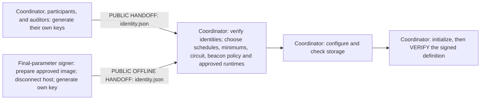
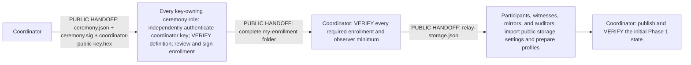
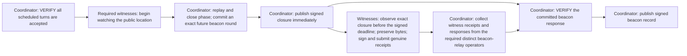
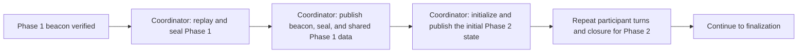
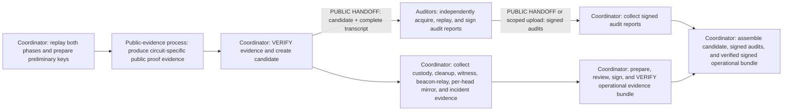
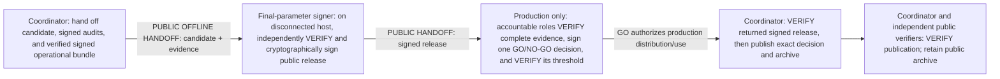

# Ceremony flow

This is the shared orientation map for a two-phase Relay ceremony. It shows
who acts, what is exchanged, and what must be verified. The guided workflow
supplies the exact current paths and commands.

## Reading the diagrams

- **PUBLIC HANDOFF** transfers only the named public files. Reporting delivery
  does not prove that the recipient received or verified them.
- **PRIVATE HANDOFF** transfers a scoped grant or connection only to its named
  owner. Never put it in public storage or evidence.
- **VERIFY** means Relay or proof-tool authenticates the indicated inputs. A
  local file, upload, website status, or checked menu item is not verification.
- Signing proves control of the enrolled key and binds exact bytes. It does not
  prove that different keys belong to independent people or organizations.

## 1. Collect identities and initialize

Before initialization, the coordinator collects `identity.json` from the
coordinator, participants, auditors, and final-parameter signer. Each owner
generates and keeps their own private `signing.hex`.

Witness and mirror public identities may be created earlier, but their numbered
setup and enrollment bind the initialized ceremony and therefore happen next.
The V5 coordinator publication path has no upload-station role. Older pinned
workflows may retain their original keyless upload station.

## 2. Distribute the ceremony, enroll roles, and publish Phase 1

The coordinator first gives each witness and mirror a numbered observer setup
file; the observer reviews and signs their own enrollment. Receiving the
coordinator key beside the definition does not authenticate that key—confirm
its fingerprint through the agreed independent channel.

Online roles also need private upload access when they act: either a scoped
standalone grant from the coordinator or their private Tessera connection.
`relay-storage.json` contains public locations, not credentials.

## 3. Run one participant turn

Repeat this lane for every participant in the signed Phase 1 schedule, then for
every participant in the signed Phase 2 schedule. The signed minimum does not
silently remove remaining scheduled turns.

```mermaid
flowchart LR
  C1["Coordinator: VERIFY current head and next participant"]
  C2["Coordinator: prepare and sign outbound custody packet in network-disabled signer"]
  P1["Participant: VERIFY packet and payload; sign receipt in network-disabled signer"]
  C3["Coordinator: VERIFY participant receipt"]
  C4["Coordinator: issue access for this exact turn"]
  P2["Participant: contribute in disposable Docker container; verify cleanup; confirm limitations; upload public candidate"]
  P3["Participant: prepare and sign return handoff"]
  C5["Coordinator: VERIFY returned files; prepare and sign return receipt"]
  C6["Coordinator: VERIFY and accept candidate; publish advanced head"]
  P4["Participant: independently confirm acceptance"]
  M["Mirror: retain this accepted head; prepare, sign and upload its matching receipt"]
  C1 --> C2
  C2 -->|"PUBLIC HANDOFF: packet + named payload"| P1
  P1 -->|"PUBLIC HANDOFF: signed receipt"| C3
  C3 --> C4
  C4 -->|"PRIVATE HANDOFF: grant, or Tessera-authorized access"| P2
  P2 --> P3
  P3 -->|"PUBLIC HANDOFF: candidate + return packet + manifest location"| C5
  C5 --> C6
  C6 --> P4
  C6 --> M
```

Uploading is not acceptance. The contribution is the only step that creates
toxic randomness. Relay verifies removal of the disposable container and
obtains the participant's signed cleanup confirmation, but this cannot prove
that no host, VM, backup, snapshot, or maliciously retained copy exists.

Mirrors produce evidence for every accepted contribution head. Their work runs
alongside the turn loop; the diagram does not claim that every mirror upload
must finish before the coordinator starts the next scheduled turn.

## 4. Close a phase and record the beacon

The deadline applies to the witness's real observation: it must occur after
closure and with the signed minimum lead time before the committed beacon
round. Signing and delivery may finish later, but late signing cannot repair a
missed observation or justify backdating one.

## 5. Move between phases

After the Phase 2 beacon is verified and published, continue directly to
finalization; there is no third phase.

## 6. Finalize, audit, and assemble evidence

The tiny and K11 test circuits use Relay's built-in real proof-evidence generator,
including when selected for a production-mode ceremony. The ownership circuit
uses its reviewed public-evidence process. Auditors and
observers are expected to be independently operated, but software verifies
their enrolled keys and signed records—not human or organizational independence.

## 7. Sign, authorize production use, upload, and archive

The signed release must exist before a production decision can bind and verify
it. Cryptographic signing alone is not authorization: a verified production GO
decision authorizes distribution and use of the exact signed circuit and
release. GO for a test circuit does not authorize ownership-proof use. A
rehearsal-mode run authenticates that this decision is not applicable.

The coordinator receives the final signer's public package, never their
private key. Import, upload, or Tessera notification still does not prove
archive verification or authorization to use the parameters. Older V4
ceremonies retain their original upload-station journey.

## Role index

| Role | Main responsibility |
| --- | --- |
| Coordinator | Initialization, authenticated ordering, acceptance, closure, finalization, evidence, authorization, and archive verification |
| Participant | Their scheduled Phase 1 and Phase 2 contributions and custody records |
| Witness | Observe each published closure in time and sign an exact observation receipt |
| Mirror | Retain every accepted contribution head and sign matching receipts |
| Auditor | Independently replay both phases and sign an audit report |
| Final-parameter signer (`release-signer`) | On a disconnected host, independently verify and sign the public release |

For exact operational instructions and recovery rules, continue with the
[guided role workflow](role-workflow.md) and the guide for your assigned role.
