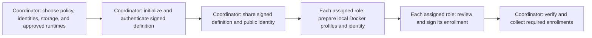
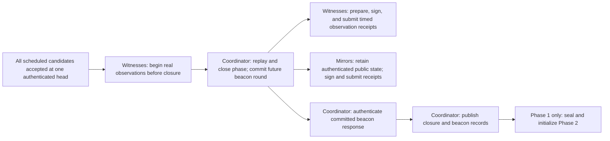

# Ceremony flow

This is the shared map for a two-phase Relay ceremony. It is an orientation
tool, not ceremony authority: Relay and proof-tool authenticate inputs before
each consequential action. A box marked **handoff** is a human delivery or
observation; reporting it is not proof that the recipient verified it.

Use the role's guided workflow for the exact current task, inputs, and
recovery path. The guide follows its authored task order; it does not choose a
later step simply because that step has fewer local inputs.

## 1. Set up, initialize, and enroll

The coordinator records a roster of distinct signing keys. It cannot prove
that the keys belong to independent people or organizations.

## 2. One participant turn (repeat in Phase 1 and Phase 2)

The signed participant schedule decides whose turn is next. Repeat this lane
for every scheduled participant; do not overlap grants or accept a candidate
without its matching custody records.

```mermaid
flowchart LR
  subgraph C["Coordinator"]
    C1["1. Inspect authenticated head and next scheduled participant"]
    C2["2. Prepare outbound custody handoff"]
    C3["3. Sign outbound handoff in offline signer"]
    C4["4. Deliver packet; collect participant's signed receipt"]
    C5["5. Verify participant receipt"]
    C6["6. Issue private grant to the scheduled participant"]
    C7["7. Receive participant's return packet; prepare/sign receipt"]
    C8["8. Verify and accept candidate; publish advanced head"]
    C1 --> C2 --> C3 --> C4 --> C5 --> C6 --> C7 --> C8
  end

  subgraph P["Scheduled participant"]
    P1["1. Authenticate assignment, phase, and current turn"]
    P2["2. Prepare/sign receipt for coordinator's outbound packet"]
    P3["3. Return signed receipt to coordinator"]
    P4["4. Run isolated Docker contribution; cleanup and upload"]
    P5["5. Prepare/sign return custody handoff"]
    P6["6. Deliver public candidate and signed return packet"]
    P7["7. Confirm independently verified coordinator acceptance"]
    P1 --> P2 --> P3 --> P4 --> P5 --> P6 --> P7
  end

  C4 --> P1
  P3 --> C5
  C6 --> P4
  P6 --> C7
  C8 --> P7
```

The participant contribution is the only step that creates contribution
randomness. Relay runs it in the disposable contributor environment, verifies
container removal, obtains the participant's cleanup confirmation, and uploads
only the public candidate. This is an authenticated operational claim, not
physical proof that no secret copy survived.

## 3. Close each phase and prepare the next one

Phase 2 repeats the participant-turn diagram above. Its closure proceeds to
finalization instead of another phase initialization.

## 4. Finalize, audit, decide, sign, and archive

```mermaid
flowchart LR
  F["Coordinator: replay both phases and prepare preliminary keys"]
  E["Public-evidence process: return public finalization evidence"]
  C["Coordinator: verify evidence and create candidate"]
  A["Auditors: independently replay and sign audit reports"]
  O["Coordinator: collect and sign verified operational evidence bundle"]
  D["Production only: accountable roles complete GO/NO-GO decision"]
  S["Final signer: independently verify candidate and sign release output"]
  V["Coordinator/upload station: verify signed release and public archive"]
  F --> E --> C --> A --> O --> D --> S --> V
```

In a rehearsal, the production decision is hidden only after Relay
authenticates that the signed definition selects rehearsal mode. A final
signature, upload, or website status is not by itself a production approval.

## Where each role fits

| Role | Main place in the flow |
| --- | --- |
| Coordinator | Initialization, each participant turn, closures, finalization, evidence, release verification |
| Participant | Their scheduled Phase 1 and Phase 2 turn |
| Witness | Observe each closure and submit a signed timed receipt |
| Mirror | Retain each accepted public state and submit matching signed receipts |
| Auditor | Independently replay both phases and sign an audit report |
| Final signer | Independently verify the candidate and sign final public output |
| Upload station | Move only approved public evidence or release files under its scoped access |

For the operational instructions and recovery rules, see
[role workflow](role-workflow.md), then the guide for your assigned role.
