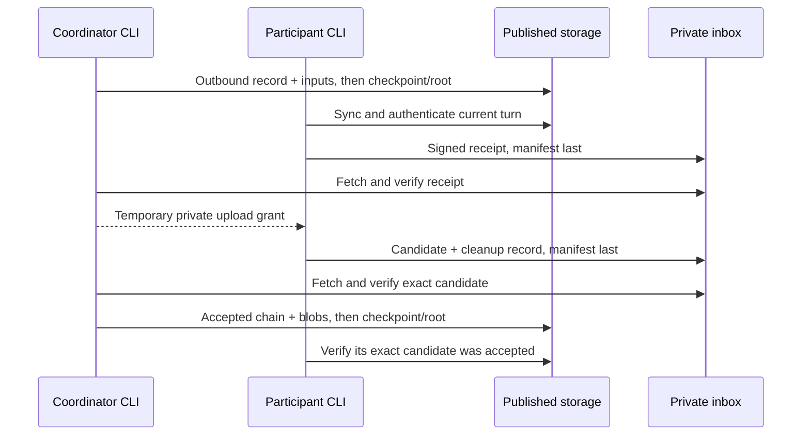

# Storage-first ceremony workflow

Status: revised proposal, September 16, 2026. The current implementation still
contains earlier envelope, acknowledgement and mandatory signer-replay behavior.
Existing released ceremonies retain their rules. This document and the linked
rollout plan specify the next version.

Final verification and release-signing trust are specified separately in
[`release-verification-trust-model.md`](release-verification-trust-model.md).
That proposal replaces this document's earlier requirement that every
storage-first release signer independently replay both phases.

This document defines the normal way Relay roles discover ceremony progress and
exchange public artifacts. S3 or R2 is the shared transport. ZIP packages remain
an explicit fallback for a deliberately offline machine or an unavailable
backend.

## Outcome

After the initial trust setup, a connected role should normally need only:

- its own local signing key and identity;
- the independently confirmed coordinator-key fingerprint, ceremony ID and
  approved Relay release;
- the public storage address; and
- typed temporary private access when that role needs to upload a submission,
  read protected review material, or publish an approved release.

When the role opens Relay, the CLI synchronizes from storage, authenticates what
it finds, and answers:

1. Which ceremony is this?
2. Which phase is active?
3. What authenticated transcript head is storage currently showing?
4. Whose participant turn is next?
5. What has this role completed, and what must it do next?

Users should not move individual files into Relay's internal directories or be
expected to know names such as `chain-0001.json`.

Witness, mirror, ceremony-auditor and external-security-audit requirements are
chosen before initialization and signed into the ceremony definition. Any of
them may be disabled, including for production. Relay must not create, display
or wait for a disabled role's work.

The precise promise is:

> Every connected role derives the authenticated public ceremony position from
> storage. It derives its next instruction from that position plus its local
> identity, independently confirmed trust, private access and locally verified
> facts.

Storage cannot reveal that a host was disconnected, a mirror really retained a
copy, a witness first observed something at a particular time, or a private
grant was received. Relay tracks those facts locally or in explicit signed
records instead of guessing them.

## Trust and security boundary

We trust the coordinator to run the required verification, follow the signed
ceremony rules and record outcomes honestly. We trust the configured storage
service to return the committed current state and stored bytes through its
documented API. Deliberate coordinator deception, storage rollback, hidden
newer states and manufactured split views are outside this version's model.

Trust does not mean every operation succeeds. Network timeouts, stale CDN
caches, interrupted uploads, accidental overwrites, wrong local files and
concurrent processes still occur. Participant input remains subject to
signature, assignment and mathematical verification.

| Area | Intended behavior |
| --- | --- |
| Mathematical verification | Coordinator fully replays; policy-required auditors also replay |
| Participant submission | Existing signed receipt, contribution and cleanup records |
| Acceptance | Signed checkpoint commits the exact verified result |
| Current step | Read the trusted storage root and validate its checkpoint |
| Upload retries | Resume identical files; delivery attempts do not express new participant consent |
| Release signer | Verify exact files, signatures and required evidence; optional independent replay |
| Failure handling | Detect incomplete uploads, wrong files, interrupted operations and concurrent writes |

We retain signatures and hashes to identify authors and catch mismatched
artifacts. A listed object or completed upload does not establish acceptance;
only the committed checkpoint does. We retain scoped credentials to prevent
one role's ordinary access from modifying another role's files.

Private signing keys and contribution randomness remain local. Long-lived
credentials are not ceremony artifacts. Bootstrap still checks the intended
coordinator, ceremony and storage address so users do not join the wrong setup.

The follow-up implementation plan is
[Trusted coordinator and storage rollout](trusted-services-implementation-plan.md).

## Signed assurance policy

The definition contains these four mandatory integer minima:

```json
"assurance_policy": {
  "public_witnesses_per_phase": 0,
  "mirrors_per_accepted_head": 0,
  "passing_ceremony_audits": 0,
  "external_security_audit_signoffs": 0
}
```

Zero disables that control. A positive value requires at least that many
distinct, valid records. Missing is never interpreted as zero. The definition
validator bounds every minimum and rejects an audit minimum larger than its
frozen auditor roster. When ceremony audits are disabled, that roster must be
empty. Witness and mirror identities may enroll after initialization: a signed
checkpoint must contain enough distinct witness assignments, enrollments and
readiness records before an enabled phase can close. Mirror assignments reserve
known future phase/index slots before the corresponding candidate is accepted;
their later receipts bind the resulting exact accepted head. When either
minimum is zero, its post-definition assignments are forbidden. Later evidence
must agree with the same signed policy.

Witness and mirror minima have fixed protocol maxima even though their
identities are assigned later. Distinctness is required within each quorum. One
identity may serve both phases or retain multiple heads, but it must have a
separate assignment and signed record for each exact scope. An enabled mirror
must be assigned and enrolled for that phase/index before its receipt can be
accepted. Listed ceremony auditors are eligible; at least the signed minimum
must enroll and submit passing reports, and every accepted report requires its
author's enrollment. `external_security_audit_signoffs` is a production-only
control and must be exactly zero in a rehearsal definition.

When a control is enabled, every supplied record is verified even when it
exceeds the minimum. Evidence from a disabled role is rejected rather than
silently ignored, keeping the final inventory closed and unambiguous. External
security-audit signoffs are a separate production control, not ceremony-role
enrollments.

The signed definition is the sole policy authority. An operational bundle may
not choose, copy with changes, or lower these minima. It either omits a policy
copy and is verified against the definition, or carries the complete canonical
policy plus definition digest and must match both exactly. Every checkpoint
that displays the policy must match the authenticated definition exactly before
Relay derives state. A bootstrap-capsule copy is only a preflight display hint;
Relay blocks if it differs from the subsequently authenticated definition.

New signed schemas represent disabled evidence collections as explicit empty
arrays. Omitted arrays are invalid and never mean disabled. When a control is
enabled, every supplied artifact is verified even above the minimum. When it is
disabled, any assignment, grant, enrollment, receipt, report or signoff for
that control is a policy contradiction and is rejected.

Disabling these controls does not weaken contribution mathematics, signed
transcript verification, cleanup acknowledgements, future-beacon verification,
coordinator approval or final release-signing requirements. It deliberately
removes different independent assurances:

| Disabled control | Assurance no longer provided |
| --- | --- |
| Public witnesses | Independent evidence that closure was publicly visible before the beacon became known |
| Mirrors | Independent retention if the primary backend deletes or withholds data |
| Ceremony audits | Independent replay of this exact ceremony and final parameters |
| External security audits | Independent review of the broader implementation and operating design |

Relay shows this loss when the coordinator chooses the policy, in the final
definition review, and in the final GO/NO-GO review. Other roles see one compact
policy summary. It does not repeat warnings before every command.

## Independent bootstrap

Backend contents alone cannot establish their own trust anchor. Before first
use, each role independently confirms:

- the coordinator public-key fingerprint;
- the ceremony ID;
- the approved Relay release; and
- the public storage origin.

Relay packages the non-secret values into one **bootstrap capsule** containing:

- ceremony ID and public storage origin;
- coordinator public key;
- approved Relay release and workflow schema;
- the signed assurance-policy minima;
- a trusted checkpoint lower-bound sequence and digest; and
- the intended role or invitation reference.

The capsule itself may arrive through storage, email or Tessera, but the role
independently compares the SHA-256 digest of its exact canonical bytes through
the agreed channel. A QR or human-readable authenticated code may be used only
if it preserves at least 128 bits of this digest and displays which fields it
binds; a short user-chosen or checksum-style code is not a trust anchor. An
invitee that already independently confirmed the coordinator key before sending
its identity may instead authenticate its capsule through the signed
setup-complete bridge described below. After that check, the large public files
can travel through storage because Relay verifies them.

Relay treats a successful read of the configured storage root as its source of
current committed ceremony state. It validates the ceremony ID, signature and
referenced files, then derives the next action.

Relay rereads that root on startup and before a consequential operation.
Mutable root responses bypass caches or are read through the provider API;
ordinary temporary inconsistencies get bounded rereads. Persistent disagreement
with a saved operation pauses that operation with a concrete error.

There is no second freshness authority, random challenge, mirror confirmation,
or first-use proof of freshness. Tessera can supply access and notifications,
but its cached progress cannot veto or override the storage root. Local saved
checkpoints support cache reuse and recovery from interruptions, rather than
serving as a defense against a dishonest provider.

## Storage layout

The current two-bucket separation remains:

```text
published bucket (publicly readable)
  blob/sha256/<digest>                         immutable bytes
  setup/<provisional-setup-id>/complete.json   signed, create-once bridge
  state/<ceremony-id>/root.json                one mutable discovery hint
  state/<ceremony-id>/phase1/head.json         mutable phase hint
  state/<ceremony-id>/phase2/head.json         mutable phase hint

private inbox bucket
  submissions/<ceremony-id>/<role>/<identity>/<kind>/<attempt>/
    files/<transport name>                     immutable payloads
    manifest.json                              written last

protected review/release staging
  review/<ceremony-id>/<kind>/<attempt>/        final files before GO/NO-GO
```

The three logical planes may use two physical buckets if the private inbox and
review prefixes have separate, tested permissions. Final proving parameters do
not enter the official public release location before an exact GO decision.

| Credential | Minimum access |
| --- | --- |
| Ordinary connected role | Public read; no private access until a typed grant is issued |
| Submission grant | Create plus exact-key HEAD/GET within one preallocated attempt; no list, replace, delete or other prefix |
| Offline-return grant | Create plus exact-key HEAD/GET for one preallocated release-result or decision-signature attempt |
| Coordinator | Authenticated root read/conditional write, published-object create, and exact expected private submissions |
| Enabled auditor/release reviewer | Read only the exact protected review objects named by its grant |
| Upload station | Read only the exact GO-approved review objects; create only in the exact official release prefix; no list, replace, delete or unrelated inbox access |

Provider preflight tests both allowed and denied operations. Storage-provider
administrators remain able to observe or disrupt data; cryptographic checks do
not remove that operational power.

The exact prefix may retain compatible existing names such as `candidates/`,
`operational/`, `audits/`, `releases/` and `decisions/`. The important rules are
semantic, not spelling:

1. Payloads are immutable and content-addressed where public.
2. A submission is discoverable only after its manifest is written last.
3. Mutable state files are hints to immutable content, never proof.
4. Every referenced object is downloaded with a size limit and re-hashed.
5. Existing bytes are never silently replaced.

### Submission transport is not a new ceremony record

Participant receipts, contribution attestations, cleanup records and optional
return handoffs are already signed by the participant and already bind the
ceremony, phase, turn, participant and relevant predecessor head or payload.
They are the participant-authored ceremony records.

An inbox `manifest.json` is an **unsigned transport-completion marker**. Relay
writes immutable payload files first and this marker last so the coordinator
knows an attempt is ready to inspect. It has a versioned, closed schema:

```json
{
  "schema": "relay-submission-transport-v1",
  "ceremony_id": "sha256:…",
  "attempt_id": "…",
  "kind": "receipt|candidate",
  "files": [
    {"name": "…", "sha256": "sha256:…", "size": 123}
  ]
}
```

`files` is sorted, has no duplicates, and contains exactly the fixed transport
inventory for that submission kind. Relay rejects unknown names, path-like
names, missing entries, duplicate entries, invalid hashes or sizes, and any
value that disagrees with the checkpoint-selected ceremony, attempt or kind.
This validates the transport claim before downloading payloads; it does not
make the manifest ceremony evidence.

The manifest is never an accepted-artifact inventory or a source of ceremony
authority. The coordinator obtains the preallocated attempt prefix from the
authenticated checkpoint, downloads only the named bounded files, then
proof-tool verifies their existing signatures and contents directly.
Proof-tool derives the canonical ceremony-logical names for every accepted
artifact; Relay only maps its private transport names to local input files.
Relay records proof-tool's verified references in the next checkpoint, not the
manifest digest.

The manifest cannot choose the expected inventory. Proof-tool derives it from
the receipt, contribution and cleanup protocols; a missing required record,
extra or conflicting record, duplicate canonical name or hash mismatch rejects
the attempt. Relay may use the marker only to decide that it is worth fetching
the fixed attempt prefix. It never publishes an inbox-only file merely because
the marker listed it.

Upload attempts are delivery tracking only. The participant signs the ceremony
artifact once; it does not separately approve each delivery attempt. An exact,
valid signed artifact may be redelivered through a replacement upload attempt.
Its existing signatures must still match the ceremony, phase, turn, participant
and predecessor.

Two outcomes must remain distinct:

- Cancel or reject a delivery attempt: retire that upload prefix; the same
  valid artifact may be delivered through another allocated prefix.
- Reject a candidate: the signed checkpoint records its exact candidate digest
  and prevents that candidate from later being accepted through any attempt.

Candidate identity must be defined by proof-tool over the complete, closed
candidate: ceremony, phase, index, participant, predecessor, contribution,
attestation/signature, cleanup record/signature and required return-handoff
evidence. Reuse an existing authenticated record ID only if it binds that whole
set; otherwise introduce a domain-separated canonical digest. It is not merely
the hash of contribution.bin. A changed candidate requires fresh verification
and an explicit new disposition, not automatic acceptance as a retry.

The rejection set is ceremony-scoped and append-only. A transport error does not
automatically reject a candidate. The coordinator records candidate rejection
only after authenticating the candidate identity/digest; malformed bytes can
retire a delivery without falsely attributing a candidate to a participant.
This version has no silent reversal of candidate rejection.

The accepted checkpoint means that the coordinator accepted these exact
participant-authored bytes. It does not claim that a participant signed an
upload-attempt ID or personally performed a particular upload.

## Authenticated state graph

Relay should not trust one global `stage` field. A ceremony can have concurrent
work: a mirror may be synchronizing while an auditor waits, and the next
participant may prepare while the coordinator verifies evidence.

Instead, Relay builds an authenticated state graph from protocol artifacts:

```mermaid
flowchart LR
  D[Signed definition and assurance policy] --> E[Core enrollments verified]
  E --> H0[Phase 1 head 0]
  H0 --> O1[Signed outbound handoff]
  O1 --> R1[Signed participant receipt]
  R1 --> C1[Candidate submission]
  C1 --> A1[Accepted Phase 1 head 1]
  A1 --> ON[Next turn or closure]
  ON --> W1[Policy-required witness readiness, or explicit zero]
  W1 --> CL1[Signed Phase 1 closure]
  CL1 --> B1[Verified future beacon]
  B1 --> S1[Signed Phase 1 seal]
  S1 --> H2[Phase 2 head 0]
  H2 --> P2[Phase 2 turns, closure, beacon and seal]
  P2 --> F[Final parameter files]
  F --> AU[Policy-required evidence verified]
  AU --> DEC[Signed production decision]
  DEC --> REL[Published release or private rejection archive]
```



Each node is identified by exact bytes, hashes, signatures and ceremony
position. Edges are protocol prerequisites. The CLI derives a readable global
summary from this graph, then derives a role-specific next action.

### Signed checkpoints and the discovery root

There is one mutable discovery object: `root.json`. It contains only a reference
to an immutable, coordinator-signed checkpoint. The root locates the committed checkpoint; the
checkpoint contains the signed ceremony decision.

Each checkpoint commits to:

- schema and workflow version;
- ceremony ID and protocol/workflow version;
- all four signed assurance-policy minima;
- a monotonic sequence number;
- the previous checkpoint digest;
- both phase heads and current closure/beacon/seal state;
- the exact accepted public-artifact inventory;
- typed pending submission slots containing kind, assignment/scope, opaque
  attempt ID, parent checkpoint/head and status; and
- any final decision and release state.

Transport boundary: Relay maintains the corresponding delivery map: approved
Relay release, provider locations and exact prefixes for each opaque slot.
Proof-tool neither interprets object keys nor generates Relay manifests.
References below to a "checkpoint-allocated prefix" mean the Relay mapping
for that checkpoint's allocated slot, not a prefix in proof-tool's schema.
The new version must specify how this map is authenticated and bound to the
ceremony/checkpoint before implementation; do not remove existing authenticated
fields without replacing that binding. This is an explicit API-design item in
the [implementation plan](trusted-services-implementation-plan.md).

Checkpoint validity includes a deterministic
`ValidateCheckpointTransition(previous, next)` rule. A valid coordinator
signature and previous digest are necessary but not sufficient. The verifier
also requires:

- immutable ceremony, definition and workflow identities;
- accepted artifacts to remain append-only;
- a phase head to extend its authenticated predecessor chain;
- closure only from an allowed head, and the next phase only after a valid seal;
- observer/evidence collections to be recomputed against the signed minima
  from the current indexed authenticated set, not remembered failed checks;
- the checkpoint policy projection to equal the authenticated definition at
  checkpoint zero and every descendant;
- the first outbound turn to follow verified coordinator, release-signer and
  scheduled-participant enrollments;
- each enabled phase closure to follow enough distinct phase-scoped witness
  assignments, enrollments and readiness records;
- each enabled mirror receipt to follow an assignment and enrollment for that
  identity and preallocated phase/index slot, then bind the resulting exact
  accepted head;
- pending submission slots to move only through `allocated`, `accepted`,
  `rejected` or `cancelled`, with replacement attempts explicitly bounded and
  allocated. At most one active slot may exist for one kind, phase, index,
  identity and parent head. Temporary credential expiry does not expire an
  attempt; and
- a terminal GO or NO-GO to be absorbing, except for the narrow post-GO
  publication-confirmation transition.

This versioned transition verifier is shared by state derivation and proof-tool
verification before the cached ceremony position advances.

A checkpoint can name:

- the signed definition and its signature;
- current Phase 1 and Phase 2 head records;
- closure, beacon and seal records;
- accepted enrollment records;
- accepted custody and candidate records;
- witness, mirror and audit evidence accepted for review when enabled;
- the final parameter manifest;
- a production approval or rejection; and
- a published release manifest.

Relay validates the checkpoint's canonical bytes, signature, schema and limits,
then follows only content-addressed references under the bootstrapped storage
origin. It re-hashes each object and asks proof-tool to authenticate the
referenced ceremony records. A signature on the checkpoint does not replace the
artifact's own protocol verification.

Checkpoint publication uploads all immutable objects and the signed checkpoint
first, then moves `root.json` once with a provider-supported conditional write
against the exact ETag/version read earlier. Relay must implement and live-test
real S3 and R2 conditional replacement; a HEAD-then-unconditional-PUT imitation
is not sufficient. Immediately before that write, Relay verifies that the new
checkpoint's `previous_checkpoint` is exactly the checkpoint named by the root
whose durable ETag/version it is using. Recovery repeats the same comparison;
an ETag from a different root read can never commit the checkpoint.

V1 permits one state-changing coordinator workspace. It holds an exclusive
local lock from review through signing and root publication. Cross-machine
coordinator mutation and automatic coordinator failover are unsupported. The
conditional root update detects an unexpected competing writer but cannot undo
two children that were already signed, which is why Relay must not sign from a
second coordinator workspace.

Only the child selected by the committed root is accepted. A signed child
whose conditional update did not commit remains unused. Relay reconciles a
timeout by reading the root: identical committed bytes complete the operation;
an unchanged parent permits resuming the saved operation; another committed
child requires refreshing state and resolving the conflict.

The existing per-phase head pointers remain useful for large transcript sync
and compatibility. They are cache hints only: authorization and guide state use
the phase heads committed by one checkpoint. A disagreement is ignored or
repaired; Relay never combines mutable pointers from different snapshots.

Each machine retains the last verified checkpoint and any unfinished operation.
When startup or an action discovers inconsistent cached data, it rereads the
trusted root and checks the associated files. It does not merge contradictory
states or replay a mutation merely because its local checklist says incomplete.

Safe reconstruction of read-only cache is permitted. Records of unfinished
signing, contribution or upload operations are preserved and reconciled before
continuing. A different root is an ordinary stale-operation or concurrency
condition, not a claim that the storage service is malicious.

Checkpoint objects, signatures and ancestry are permanent ceremony artifacts in
V1 and are never garbage-collected. The policy bounds checkpoint count and byte
size. A later compaction design would need signed skip links or snapshot
certificates before any ancestor could be removed.

Checkpoint signing runs in the coordinator's network-disabled signing container.
The connected Relay process supplies canonical checkpoint bytes and receives
only the public signature. This is an operational checkpoint signature: every
referenced ceremony artifact still needs its own proof-tool verification.

### Synchronization algorithm

Opening a connected role performs bounded metadata synchronization:

1. Fetch the one root from the bootstrapped origin.
2. Fetch its named immutable checkpoint by digest.
3. Walk every checkpoint missing between the cached/bootstrap checkpoint
   and the root checkpoint. For each step, verify the checkpoint envelope,
   digest and signature, then fetch and authenticate every small referenced
   artifact required to validate that transition. Missing ancestry, invalid
   inner records, excessive depth or excessive total bytes blocks
   synchronization; verified prefixes are cached.
4. Fetch and authenticate the small records needed to determine this role's
   assignment. A checkpoint signature never substitutes for these protocol
   checks.
5. Only after the complete checkpoint protocol state passes, atomically write
   and sync its digest, sequence and phase-head digests. If this durable write
   fails, Relay permits read-only inspection only.
6. Derive global position, ready/waiting actions and the next instruction.
7. Download large transcript or parameter payloads only when the selected task
   needs them. Mirrors and auditors may request a full synchronization.
8. Immediately before signing, contribution, grant issuance, acceptance or
   publication, reread the root. If it no longer names the expected checkpoint,
   recompute prerequisites instead of continuing from stale input.

Absolute URLs supplied by a checkpoint are rejected. References are safe
relative object keys beneath the independently bootstrapped origin.

The coordinator obtains and conditionally replaces `root.json` through the
authenticated provider API, not a CDN or anonymous public URL. After committing,
it separately verifies that the public origin serves the exact root and
checkpoint.

### Artifact authorship

| Artifact | Signer | What it means |
| --- | --- | --- |
| Definition and initial transcript | Coordinator | Freezes the ceremony, roster, policy and initial state |
| Observer assignment | Coordinator | When enabled, assigns one witness or mirror identity, number and scope |
| Checkpoint | Coordinator | Accepts one coherent graph of already verified artifacts |
| Outbound custody record | Coordinator | Offers exact public input for one participant and parent head |
| Input receipt | Assigned participant | Confirms receipt of those exact input bytes |
| Candidate attestation, cleanup record and optional return handoff | Assigned participant | States the exact public output, cleanup claim and custody return when applicable |
| Accepted chain and checkpoint | Coordinator | Accepts that exact verified output or records a typed rejection |
| Witness or mirror receipt | That assigned observer | When enabled, reports its own observation or retained copy for one exact checkpoint |
| Audit result | Assigned auditor | When enabled, reports verification of the named complete input set |
| Release manifest | Release signer | Signs the exact final file inventory reviewed offline |
| GO or NO-GO decision | Identities required by signed policy | Authorizes only the exact manifest and evidence named |
| Discovery root | Nobody | Locates a checkpoint; it is never authority |

The checkpoint cannot convert an invalid inner artifact into a valid one. Its
signature means the coordinator accepted this coherent set, while the inner
signature identifies who made each underlying claim.

### State used by the guide

For every role, Relay computes four values:

| Value | Contents |
| --- | --- |
| Current state | Verified checkpoint and artifacts, local identity, authenticated assignments, cached position and unresolved local operations |
| Ready actions | Authored actions whose cryptographic and operational prerequisites are satisfied |
| Waiting actions | Authored actions with an exact missing input or another role that must act first |
| Next action | The highest-priority ready required action; if none is ready, the first blocking wait |

File presence alone never satisfies a prerequisite. Verification results are
bound to each file's digest, so replacing a file invalidates the result.

Actions form a dependency graph, not one total list. Authored order is a stable
tie-breaker between ready actions; it is never a heuristic based only on which
files happen to exist. A waiting action does not hide unrelated safe preparation,
but no action may skip an actual predecessor.

The same authenticated facts and role identity must produce the same next
action under the same Relay release.

## Before initialization

A signed ceremony ID and checkpoint do not exist while the coordinator is still
assembling the roster. This is a separate draft lane, and the CLI must call it a
**coordinator draft**, never authenticated ceremony state.

1. The coordinator creates a random provisional setup ID and role invitations.
2. Each invitee independently generates its key and uses a narrow invitation
   grant to upload only `identity.json` to a protected setup inbox.
3. The coordinator reviews the expected identities and roles. The core roster
   and any ceremony auditors are frozen at initialization; enabled witness and
   mirror assignments may be added later under the signed minima.
4. Initialization freezes that roster, assurance policy, storage namespace,
   workflow schema and initial checkpoint.
5. The coordinator publishes a signed, create-once record at
   `setup/<provisional-setup-id>/complete.json` in the publicly readable plane.
   It contains a bounded map from each unguessable invitation ID to that role's
   bootstrap-capsule digest. The random setup and invitation IDs provide
   discovery privacy; the signature and previously confirmed coordinator key
   provide authenticity.
6. Invitees poll that path, verify it with the coordinator key they already
   confirmed, accept only the entry matching their own invitation and identity,
   verify that capsule digest, and continue without a second manual handoff or
   independent digest comparison.
7. Formal proof-of-possession enrollments follow against the signed ceremony.
   Before the first participant turn, a checkpoint verifies the coordinator,
   release-signer and all scheduled-participant enrollments. Witness readiness
   is checked before each enabled phase closure. Mirror assignments reserve
   phase/index slots before candidate acceptance, and their exact-head receipts
   are required before final evidence review.

An invitation grant is tied to one setup ID, role and assignment. Uploading an
identity does not assign or authenticate it; coordinator review and signed
initialization do. If a deployment cannot issue invitation grants, identity JSON
is the one connected-role public handoff allowed through the agreed channel.
An unused provisional invitation is only a draft artifact: it confers no
ceremony role, must expire or be revoked, and never enters a signed checkpoint
or final evidence inventory. The prohibition on disabled-role grants and
assignments applies after the assurance policy is frozen.

## One complete Phase 1 turn

This is the first implementation slice.

### 1. Coordinator publishes the turn

From the authenticated chain head and signed participant schedule, Relay derives
the next participant automatically. The coordinator prepares and signs the
outbound custody record for that exact head and participant. The online Relay
process uploads the record and every named public input, then updates the
signed checkpoint and discovery root.

The coordinator CLI now says that it is waiting for the assigned participant's
signed receipt. It does not offer a grant first.

### 2. Participant discovers and receives it

The participant CLI synchronizes the signed checkpoint and head, confirms that its
identity is next, downloads the exact outbound record and named inputs, and
verifies all hashes and signatures. No manual directory placement is needed.

The participant creates the existing signed input receipt in the
network-disabled signing container and uploads its record and detached signature
to the private inbox prefix. That receipt already binds ceremony, phase, turn,
parent head, participant identity, coordinator handoff and exact received files.
The outer manifest is an unsigned transport-completion marker, not
authentication. The participant retains the attempt ID locally.

The outbound checkpoint preallocates that receipt attempt and exact inbox
prefix. Tessera or the protected control channel supplies a
receipt-submission grant restricted to it. This is distinct from the later
candidate grant. The authenticated checkpoint—not the participant's local
copy—remains the authority for the attempt ID; the local copy only assists
journaling and recovery.

### 3. Coordinator verifies the receipt and issues a grant

The coordinator fetches the unsigned manifest from the exact preallocated
inbox prefix, downloads the fixed receipt files with strict limits, and verifies
their existing participant signature, ceremony, phase, turn, parent head and
file hashes. The next signed checkpoint is the acceptance record. Only then may
Relay issue the participant's temporary candidate-upload grant through Tessera
or the protected coordination channel.

Before signing the receipt-accepted checkpoint, the coordinator allocates the
candidate attempt ID and commits its exact inbox prefix in that checkpoint. It
then issues the grant for that already committed prefix.
The grant is never put in the published bucket. The storage credential is
restricted to one checkpoint-allocated prefix. Relay and Tessera verify its
association with the signed head, outbound record, receipt-accepted checkpoint,
participant and candidate attempt ID before issuing it; the credential itself
does not cryptographically contain those facts. Participant credentials
may `HEAD`/`GET`/create objects only within their exact attempt prefix so Relay
can safely resume without giving them bucket-wide `LIST`, overwrite or delete.

### 4. Participant contributes and submits

The participant rechecks the published head immediately before computation.
Relay runs the contribution in its disposable, network-disabled container,
checks container cleanup, creates the existing signed contribution attestation
and cleanup record, and uploads immutable files followed by `manifest.json`.

Upload completion means only **submitted for verification**.

### 5. Coordinator accepts the exact candidate

The coordinator fetches the unsigned manifest from the preallocated candidate
prefix, then verifies the existing signed contribution attestation, cleanup
record and optional return handoff. Proof-tool checks identity, assignment,
parent head, contribution proof, cleanup claim and exact file hashes. If a
return handoff is required, the participant creates and signs it and includes
it in the same submission; the coordinator never authors a participant-side
custody event.

The coordinator advances the signed chain only for that exact candidate. The
new signed checkpoint is the sole globally committed acceptance transition: it
binds the accepted participant records, identity, scope, attempt and exact
artifact hashes. The accepted chain remains the underlying cryptographic
contribution record. A rejection checkpoint binds the allocated attempt, kind,
identity, basis checkpoint, parent head and a non-sensitive reason code; it may
carry observed digests for diagnosis, but never treats invalid payloads or the
unsigned manifest as accepted ceremony evidence. It permits a new attempt.

The new accepted chain and referenced public bytes are uploaded first; a new
signed checkpoint is created and `root.json` moves last.

### 6. Participant confirms acceptance

The participant CLI observes the new signed chain and verifies that the accepted
record contains its exact candidate digest and expected parent head. Only then
does it report **accepted**. A different valid candidate by the same identity
does not complete this task.



## Role-specific inference

The coordinator, at least one participant, and the distinct release signer
remain core roles. Witness, mirror and auditor rows apply only when their signed
minimum is positive. A zero minimum removes the corresponding assignments,
grants, evidence dependencies and guide actions; an empty array alone never
proves that a role is disabled.

If someone directly opens a witness, mirror or auditor launcher that the
authenticated policy disables—or for which that identity has no assignment—
Relay shows read-only ceremony status and **This role is not enabled or assigned
for this ceremony**. It refuses to create assignments, grants, submissions or
completion records from that launcher.

| Role | Reads and authenticates | Writes | Derived next action examples |
| --- | --- | --- | --- |
| Coordinator | Signed public checkpoint graph plus bounded complete private-inbox submissions | Signed operational records, accepted transcript state and checkpoints | Publish outbound turn; verify receipt; issue grant; verify candidate; close phase |
| Participant | Definition, assignment, current head, outbound record and later accepted head | Signed receipt, candidate and cleanup record to its private prefix | Wait for turn; acknowledge input; contribute; submit; confirm exact acceptance |
| Witness, if enabled | Definition, signed observer assignment, announced closure and future beacon data | Signed observation to its private prefix | Start watcher; preserve first observation time; observe required interval; submit receipt; wait for acceptance |
| Mirror, if enabled | Definition, signed observer assignment and each authenticated published checkpoint | Signed receipt for its independent destination | Synchronize missing immutable objects; verify exact checkpoint; submit receipt; wait for acceptance |
| Auditor, if enabled | Complete authenticated transcript, expected evidence inventory and protected final files | Signed audit result to its private prefix | Wait for the complete required set; run full verification; submit result; wait for acceptance |
| Release signer | Frozen review checkpoint, coordinator-signed final-candidate checkpoint, exact final files and all policy-required evidence | Signed release ZIP; a separate decision-signature ZIP only if assigned that duty | Fully verify non-mathematical records and exact files while trusting the coordinator's replay claim; sign final release; later sign the production decision if assigned |
| Upload station | Offline return ZIP, then terminal GO checkpoint and matching protected release | Preallocated private release-result submission, then approved closed-world public release | Return signer result for coordinator verification; publish only when GO names the exact release bytes |

When enabled, witness and mirror numbers, identities, phases and scopes live in
signed observer assignment records that their CLIs download automatically.
Uploading an identity does not create an assignment. Starting a witness watcher
creates a short-lived signed readiness submission bound to its assignment,
phase, checkpoint and expiry. The coordinator verifies the signed readiness
minimum before closure. This authenticates a readiness claim; it cannot prove
the witness kept watching.

Enabled witnesses, mirrors and auditors infer what work exists from
authenticated public checkpoints. The coordinator does not scan or trust a
role-written submission index. It allocates each attempt in the predecessor
checkpoint before issuing an exact-prefix grant and records the expected inbox
prefix there. Tessera's submission notification is only a hint to fetch that
already known location.

Replacement attempts are explicitly allocated and bounded; two valid attempts
are never resolved by a timestamp or “latest” heuristic. The coordinator
verifies and selects one exact attempt; the next signed checkpoint records the
outcome. Other roles see their acceptance or rejection in a later checkpoint.
An upload alone never completes their duty. The same pattern applies to
enrollment, witness, mirror, audit, release and decision submissions.

Typed private grants cover three journeys:

- exact-prefix submission writes for participants and observers;
- exact-object protected-review reads for auditors and offline-package staging;
- exact-prefix release promotion after GO.

Tessera supplies them automatically. Standalone mode shows one explicit private
grant import as the missing prerequisite; it never asks the user to move the
public payload files manually.

Every typed grant names the exact checkpoint and attempt it authorizes, so an
already required grant also confirms the operation it belongs to. Standalone V1
does not add a separate manual status exchange before every action.

Mirror destination credentials remain local to an enabled mirror. The shared
storage root supplies ceremony progress for all connected roles. No independent
checkpoint service is required.

### Future beacon without witnesses

Witnesses and the beacon are independent controls. Even when
`public_witnesses_per_phase` is zero, closure still binds one exact future drand
round. Relay waits for that round, retrieves the required independent relay
responses, verifies the drand signature and applies the randomness. It skips
only witness readiness, observation deadlines and witness receipts.

Without witnesses, nobody independent attests that the closure was publicly
visible before the beacon became known. The coordinator's signed time and
backend history remain evidence, but are not a trusted timestamp. A malicious
coordinator could wait for the round, backdate a closure and publish both
afterward. The future drand mechanism still supplies public randomness when the
honest procedure commits before the round, but Proof-tool cannot establish that
ordering from the coordinator's signature alone. Ceremonies requiring that
assurance must enable witnesses. A future schema could support a separately
trusted commitment-timestamp source only if that source and its rules are
frozen in the signed definition before the relevant closure. An existing no-
witness ceremony can never add this assurance retroactively after the beacon
round is known.

The definition keeps a beacon-round lead rule separate from any witness-
observation window; setting the witness minimum to zero never sets the beacon
lead or `future_round_required` to zero. Verification still checks the exact
committed round, drand signature and required independent relay responses. The
CLI and final decision display that prior public commitment was not
independently established.

### Configurable beacon lead

The coordinator chooses the beacon lead before initialization for both
rehearsal and production. Relay writes it into the policy, Proof-tool signs it
into the ceremony definition, and every later close, checkpoint and release
verifies that exact value. It cannot be changed after initialization.

Relay offers mode-specific defaults rather than hard-coded validity rules:

- rehearsal default: 180 seconds; automated tests may use 12 seconds;
- production default: 24 hours.

A shorter production value is allowed, but the CLI must show the chosen value,
the recommended 24-hour value and the lost review/observation time immediately
before the coordinator signs the definition. It must never silently substitute
a shorter value. If public witnesses are enabled, the existing production
witness-observation window is reserved in addition to the configured beacon
lead, and Relay displays the resulting total minimum close-to-round wait.

This is a new signed-policy behavior. Existing versioned setup contracts and
existing ceremonies keep their original rules. The storage-first Relay setup
contract gets a new version; its guided setup exposes the setting for both
modes and passes it unchanged to Proof-tool.

## Exact approval example

Suppose the final signer reviews release A, whose manifest hash is
`sha256:aaaa...`, and signs **GO** for that hash. A bug or operator later creates
release B with hash `sha256:bbbb...`.

The upload station must reject B even if:

- B belongs to the same ceremony;
- B has a valid release-manifest signature; and
- most files happen to be identical.

Before review, proof-tool validates a closed inventory: required logical names,
counts, sizes, hashes, circuit, curve, backend and key version, with no extra
files. The coordinator then creates a signed **review checkpoint** that freezes
this complete input set. After the freeze, only release, decision, or one
explicit `ReviewCancelled` transition is allowed. Cancellation names the frozen
checkpoint and a non-sensitive reason. Only after it is committed may corrected
evidence be accepted and a new review checkpoint and offline package be created.
Signatures and ZIP returns bound to the cancelled review remain historical
records but can never authorize a decision.

The approval record signs the exact manifest bytes digest—not a parsed
and reserialized copy—and names:

- the ceremony and review checkpoint;
- manifest digest and size;
- final parameter, audit and evidence-bundle digests;
- decision sequence, policy and required signers; and
- destination and release identity.

The production decision retains a fixed, visible gate list. Its status
vocabulary is `PASS`, `FAIL`, `PENDING` and `NOT_REQUIRED`. Gate status is
deterministic:

| Production gate | Signed policy field | Required status when zero | Allowed GO status when positive |
| --- | --- | --- | --- |
| Public witnessing | `public_witnesses_per_phase` | `NOT_REQUIRED` | `PASS` |
| Independent mirrors | `mirrors_per_accepted_head` | `NOT_REQUIRED` | `PASS` |
| Ceremony audits | `passing_ceremony_audits` | `NOT_REQUIRED` | `PASS` |
| External security audit | `external_security_audit_signoffs` | `NOT_REQUIRED` | `PASS` |

Zero requires `NOT_REQUIRED` and an explicit empty evidence inventory; `PASS`
would falsely claim the disabled assurance occurred and is rejected. A positive
minimum forbids `NOT_REQUIRED`, and GO requires `PASS` backed by the exact
policy-required evidence. Every other GO gate must also be `PASS`; a
coordinator cannot weaken this mapping in a later decision.

When `passing_ceremony_audits` is zero, a coordinator-signed final-candidate
checkpoint stating that full replay passed is still required, but no
independent full replay is claimed. The frozen review checkpoint binds that
checkpoint, candidate, operational bundle and the complete ceremony-
audit and external-audit inventories. Those arrays are explicitly empty when
their minima are zero. When an external minimum is positive, the checkpoint,
release approval and decision all bind the exact closed report/signoff
inventory.

`released_at` must strictly follow the authenticated frozen review checkpoint,
whose creation in turn strictly follows candidate finalization and operational-
bundle assembly. This is the single chronology anchor whether or not audits
exist; verification never compares with a zero timestamp. When enabled, every
supplied audit artifact is signature-, identity- and content-verified even
above the minimum. When disabled, any audit artifact is rejected as a policy
contradiction.

These signed timestamps enforce claimed record ordering and require operators'
clocks to be sane; they are not an external proof of wall-clock time. The exact
checkpoint ancestry and bound artifact digests remain the authorization
boundary.

Decision signatures bind the review checkpoint. The coordinator verifies the
required signatures and creates one **terminal decision checkpoint** descending
from it. The upload station fetches that terminal checkpoint, re-verifies this
dependency set, re-hashes its input and publishes only if every value matches.
Approval of A can never authorize B. An older GO cannot override a later
terminal outcome, and one review checkpoint cannot accept both GO and NO-GO.

In plain language: changing any final file requires a new review and a new
approval.

If the decision is **NO-GO**, Relay may preserve a privacy-checked archive in
protected storage for investigation, but it never publishes the final proving
parameters as an approved release.

The final sequence is explicit:

1. The offline release signer reviews the complete candidate/evidence set and
   returns a signed release manifest.
2. The coordinator verifies it and prepares a decision bound to that manifest.
3. The accountable decision signers sign GO or NO-GO. These are always the
   coordinator and release signer, plus every ceremony auditor whose accepted
   report is bound into the decision. If the release signer is also a decision
   signer, this requires a second offline exchange.
4. The coordinator publishes the one accepted terminal decision checkpoint.
5. A keyless upload station can promote only the exact GO-bound release. It may
   publish only the approved manifest bytes, files enumerated by that manifest,
   required signatures, and a deterministic release pointer derived from the
   decision. Extra sidecars or unreviewed files are rejected.
6. The coordinator independently polls, downloads and verifies the official
   release, then signs the final `ReleasePublished` checkpoint. Until then all
   CLIs say **GO approved; publication not yet verified**. No upload-station
   receipt is treated as authority or added to the approved public inventory.

## Offline signer and ZIP fallback

The final signer is the deliberate exception to live backend inference. Its
machine may be disconnected.

1. An online staging machine synchronizes and authenticates the frozen review
   checkpoint.
2. Relay exports one deterministic `.relay.zip` containing the exact bounded
   input set and a strict manifest.
3. The offline machine verifies the package, approved software and trust
   anchors, then signs the exact result.
4. Relay exports one return ZIP containing only the signed public result.
5. The online upload station imports and re-verifies it, then uploads it through
   a preallocated `release-result` private submission slot. The coordinator
   fetches and verifies that exact manifest before preparing a decision.
6. If the release signer is also a decision signer, its second offline return
   uses a separately preallocated `decision-signature` submission slot.

The ZIP records the source review-checkpoint digest. If that freeze was
explicitly cancelled, the return is rejected and a new package must be reviewed.
ZIP does not become the default for connected roles.

During a storage outage, ZIP may carry already authenticated public inputs for
inspection or preparation, using the same strict manifests. Participant turns,
closure, witness observation, acceptance and publication pause until storage
returns. Only the deliberately offline
final-signer workflow may complete signing while disconnected. There is no
loose-folder mode that asks users to reconstruct Relay paths.

## Failure and recovery

The public backend is the recoverable shared record of accepted public progress.
Most downloaded local files are a verified cache. The coordinator's mutation
journal, every role's unresolved-operation journal, private grants, witness
observation time and local secrets are safety-critical local state and cannot be
reconstructed from public storage.

Coordinator journaling has two durable levels:

1. Before each inner signature, Relay records the operation ID, parent
   checkpoint/root version, signer and scope, digest of the canonical unsigned
   artifact and expected signature path.
2. After signing, Relay verifies and records the resulting signature digest.
   Once every inner reference is fixed, Relay constructs the checkpoint and
   durably records its canonical digest and expected root version before asking
   for the checkpoint signature.

Every journal update uses write, file sync, atomic rename and parent-directory
sync. Startup reconciles the oldest unresolved signature intent before allowing
another signature; it never jumps directly to a replacement checkpoint. Missing
or mismatched coordinator safety state after mutation blocks state-changing
work. The coordinator workspace is not a replaceable cache.

- Downloads go to a staging directory, are size-checked, hashed and
  authenticated, then move atomically into the role workspace.
- Uploads allocate a stable attempt ID before starting. Immutable payloads are
  uploaded first and the manifest last.
- A missing manifest means the submission is incomplete and ignored.
- On restart, no manifest resumes only identical missing payload uploads before
  creating the manifest. A valid manifest with matching payloads is adopted.
  A manifest with temporarily unavailable payloads triggers bounded rereads;
  conflicting manifest or payload bytes are never overwritten and require a
  signed rejection or cancellation before a replacement attempt is allocated.
- A retry with the same checkpoint-allocated attempt ID verifies any existing remote bytes and
  sends only missing identical objects. Acceptance deduplicates by signed record
  ID, never object path or timestamp.
- A conflicting object is an error; Relay never overwrites it.
- Before a state update, Relay records the expected previous root version,
  attempt/checkpoint ID and exact output digests. After a crash it reads those
  exact objects and the current root. It then adopts the already committed exact
  checkpoint, finishes the same conditional update if the root is unchanged, or
  blocks because another checkpoint won. It never signs a replacement
  acceptance automatically.
- Relay offers one concrete recovery action: continue the safe remaining work,
  inspect an uncertain local result, or wait for another role.
- A read-only verification is re-runnable and its older failure does not block a
  later successful verification of the current bytes.
- Signing, contribution and publication operations retain stricter uncertainty
  handling when the child may have produced output.

### Private grant recovery

Before requesting any temporary credential, Relay durably records:

```text
grant request ID
submission attempt ID and exact prefix
checkpoint digest
requested lifetime
```

Credential generations use separate states:

```text
planned | issued | saved | export shown | delivery reported | expired/revoked
```

Tessera treats the grant request ID idempotently and returns the same unexpired
result. In standalone mode, Relay saves the credential atomically before showing
or exporting it. A saved unexpired credential can be shown again after restart;
Relay never equates that with recipient receipt. If issuance may have succeeded
but cannot be queried, Relay does not create another live credential until the
first is revoked or its maximum lifetime has passed. Delivery to the role
remains a separate private fact or explicit human report.

An expired credential does not force recomputation. Relay renews access only to
the same already committed attempt prefix and resumes the upload. A replacement
contribution requires an explicit new attempt slot and grant.

### What “restart” means

Restart means reopening the same role workspace with its durable journal and
secrets intact. A new empty workspace is a first-use/adoption flow, not a
restart.

| Situation | What Relay can safely do |
| --- | --- |
| Same workspace reopened | Synchronize public progress, reconcile the journal and continue the one safe remaining action |
| New workspace with restored key and bootstrap | Recover accepted public progress only; do not claim unpublished/local work |
| Participant lost local attempt state | Inspect the exact checkpoint-preallocated remote manifest with a replacement grant, or explicitly abandon it and allocate a new attempt |
| Witness lost observation bytes/time | Mark the observation missed or uncertain; never reconstruct a timestamp |
| Mirror lost destination mapping | Reconfigure the destination and prove retention again |
| Offline package lost | Export a new package for the current valid frozen review |
| Coordinator workspace lost after mutation began | Read-only inspection; do not sign from a replacement workspace |

If the local journal is missing or corrupt while an operation may have produced
a signature, contribution or upload, Relay reports that recovery is
indeterminate and never repeats the operation automatically.

Relay must not infer a human-only fact—such as independent key confirmation,
machine cleanup, or delivery of a private grant—unless there is an explicit
record for that fact.

Every submission kind has an executable allowlist for paths, media types, file
counts and byte sizes. Relay snapshots regular files without following links and
rejects devices, links, traversal, unexpected files and private-material names.
Before promoting inbox contents, it runs the type-specific privacy and protocol
checks. Provider administrators can still see private inbox contents and
metadata; V1 does not claim otherwise.

## Concurrency and ordinary storage failures

- One coordinator workspace performs mutations; a local lock prevents two
  processes from writing simultaneously.
- Conditional root updates prevent an older operation from replacing a newer
  committed state.
- Each acceptance still matches the exact participant, turn and predecessor.
- A cached-root disagreement causes a bounded fresh read and reconciliation.
- Tessera's display may lag storage and is refreshed from it.
- Mutable root caching is disabled; immutable artifact caching is permitted.
- Timeouts do not imply failure or success: read the exact destination before
  deciding whether an operation committed.

Witnesses, when enabled, still use their actual first observation time and the
signed beacon target. Missed observation windows cannot be recreated by a
retry. Ordinary download failures may retry within the real observation window.

Public downloads retain deadlines, file-size bounds, safe paths and staged
writes. No challenge-response freshness system, alternative trusted root or
malicious-provider simulation is required by this model.

## Symbolic model

Model the workflow as authenticated facts and transitions, not one enormous UI
tree.

Example facts:

```text
DefinitionVerified(ceremony)
AssuranceMinimum(ceremony, control, count)
Assigned(identity, role, index)
CheckpointVerified(sequence, digest, previousDigest)
HeadVerified(phase, n, digest, checkpointDigest)
OutboundPublished(phase, n+1, identity, parentDigest, attempt)
ReceiptVerified(phase, n+1, identity, outboundDigest, attempt)
GrantPlanned(requestID, attempt, checkpoint, exactPrefix, lifetime)
GrantIssued(requestID, attempt, checkpoint, exactPrefix, credentialGeneration)
CandidateSubmitted(phase, n+1, identity, candidateDigest, parentDigest, attempt)
CandidateAccepted(phase, n+1, identity, candidateDigest, parentDigest, attempt)
DeliveryRetired(attempt, reason)
CandidateRejected(ceremony, candidateDigest, reason)
PhaseClosed(phase, headDigest)
ReviewFrozen(reviewCheckpoint, manifestDigest, evidenceDigest)
ReviewCancelled(reviewCheckpoint, reasonCode)
ReleaseReviewed(reviewCheckpoint, manifestDigest)
DecisionSigned(outcome, reviewCheckpoint, manifestDigest)
TerminalDecisionCommitted(outcome, terminalCheckpoint, reviewCheckpoint, manifestDigest)
ReleaseUploaded(terminalCheckpoint, manifestDigest)
ReleasePublished(publishedCheckpoint, terminalCheckpoint, manifestDigest)
```

Each action declares preconditions and effects. For example:

```text
AcceptCandidate requires
  CheckpointVerified(s, cp, previous)
  HeadVerified(p, n, h, cp)
  Assigned(i, participant, n+1)
  ReceiptVerified(p, n+1, i, outbound, receiptAttempt)
  CandidateSubmitted(p, n+1, i, c, h, candidateAttempt)
  CandidateNotRejected(ceremony, c)
  ParticipantRecordsVerified(ceremony, p, n+1, i, c, h)

AcceptCandidate produces
  CandidateAccepted(p, n+1, i, c, h, candidateAttempt)
  AcceptancePrepared(s+1, cp2, cp, h2)
```

The crash model expands that last abstract effect into observable steps:

```text
InnerSignatureIntentDurable
AcceptanceSigned
ImmutableObjectsUploaded
CheckpointIntentDurable
CheckpointSigned
CheckpointUploaded
RootCASAttempted
RootCASCommitted
RootRead
CheckpointVerified
CachedPositionRecorded
ActionStarted
```

Only a validated checkpoint selected by the configured storage root produces
the normal `CheckpointVerified` fact.
Reconciliation may finish the same recorded conditional write or adopt its exact
committed result; it never creates a new signature automatically.

The model must check at least these invariants:

1. No action succeeds because an object merely exists.
2. No participant receives authorization before its exact input receipt passes.
3. No candidate is accepted for the wrong identity, turn or parent head.
4. A participant is complete only when the accepted chain names its exact
   candidate.
5. No mutable hint is used as cryptographic authority.
6. No private grant or signing key reaches public storage.
7. No approval authorizes a different final manifest.
8. A rejection never produces an approved public release.
9. A cached-position conflict is reconciled against a fresh provider root read
   before any dependent mutation.
10. For identical authenticated facts, identity and software version, the
    guide chooses the same next required action.
11. Concurrent ready work is visible without allowing required prerequisites to
    be skipped.
12. An offline return is accepted only for the checkpoint and files it reviewed.
13. Every signature requires its exact durable intent, and one parent produces
    only one signed child unless recovery resumes the identical intent.
14. A root commit requires the exact signed checkpoint to exist immutably first,
    its previous digest to equal the checkpoint in the root being replaced, and
    the conditional token to come from that exact durable root read.
15. Cached position advances only for a validated, committed checkpoint.
16. Every mutation durably records its expected parent and exact inputs before
    starting.
17. Grant issuance requires the matching durable request, attempt, checkpoint
    and exact prefix.
18. Grant renewal preserves the same attempt and prefix; credential expiry does
    not terminate the attempt.
19. A replacement attempt requires the previous slot to be explicitly rejected
    or cancelled.
20. A role is skipped only when the authenticated definition sets its exact
    minimum to zero; absence of a file, assignment or local fact cannot disable
    it.
21. A disabled role has no assignment, grant, accepted evidence or waiting
    action, while every supplied artifact for an enabled role is verified even
    after its minimum is satisfied.
22. Zero witnesses removes only witness evidence; it never removes the future
    beacon, committed round or multi-relay verification.
23. GO accepts `NOT_REQUIRED` only for a gate whose matching authenticated
    minimum is zero.
24. Delivery retirement does not reject an artifact; candidate rejection blocks
    that exact candidate across all subsequent delivery attempts.

Facts for enabled enrollment, witness, mirror and audit duties are indexed by
identity, assignment, checkpoint, attempt and artifact digest. Collection
completion is a predicate over the authenticated minima and current set, never
a sticky result from an old failed check. The model explores zero and positive
minima explicitly; it never treats a missing fact as a policy choice.

TLA+ is suitable for the state, concurrency and crash properties. It does not
reimplement cryptography: signature and hash verification are modeled as
trusted predicates, then Go integration tests confirm the real verifier is
called at every boundary. TLC exhaustively checks bounded configurations; the
result is not a proof for unbounded ceremonies or the Go implementation.

## Test strategy

### Model tests

- Use small compositional models for checkpoint/root/crash behavior, one phase
  turn with duplicate attempts, evidence/quorum/timing, and decision/release.
- Explore reordered, duplicated, missing and conflicting checkpoint updates.
- Pair a valid checkpoint with another root version's ETag and confirm the
  conditional update is rejected before publication and during recovery.
- Explore stale local heads, cache lag, delayed responses and concurrent
  coordinator updates under documented provider consistency. Deliberate
  provider rollback and split views are outside this model.
- Explore crash points before each payload, manifest, accepted chain, checkpoint
  and root update.
- Mutate identity, phase, turn, parent digest, candidate digest and release
  digest independently.
- Check safety invariants and useful reachability for every role in bounded
  configurations.
- Add deliberately broken configurations to confirm every invariant can fail
  when its guard is removed.
- Explore all eight enabled/disabled combinations for witnesses, mirrors and
  ceremony auditors. Model external security-audit signoffs separately because
  they are not ceremony-role assignments.
- Prove that zero is reachable only through an authenticated explicit minimum,
  and that omitted policy, injected disabled-role evidence, and
  `NOT_REQUIRED` on an enabled gate are rejected.
- Explore the honest no-witness path while recording the explicit limitation:
  the model must not manufacture a trusted before-beacon commitment fact from a
  coordinator timestamp.

### Go tests

- Define one versioned, machine-readable transition/action vocabulary with
  stable predicate IDs. Export bounded model traces as checked-in fixtures that
  map authenticated facts—including time, grant status and unresolved local
  operations—to legal transitions and the next action.
- Run the real Relay evaluator and proof-tool transition verifier against every
  fixture. CI regenerates and diffs the fixtures, or verifies their source hash;
  mutation tests remove each dependency edge to prove the suite detects drift.
- Feed the real state-derivation engine synthetic S3/R2 object graphs.
- Assert the exact role summary, waiting reason and next action for every state.
- Require proof-tool verification results, not fixture file presence.
- Cover scoped role credentials, coordinator exact-prefix inbox retrieval,
  existing participant record verification, bounded downloads, manifest-last
  uploads and conditional root writes.
- Reject a manifest written before payload completion, missing/unknown/duplicate
  transport names, bad hash/size, wrong ceremony/attempt/kind, confusing path
  names and a manifest corrupted after otherwise valid signed payloads. Assert
  that no unsigned manifest enters accepted evidence.
- Allow identical valid records to be redelivered in a newly allocated attempt
  after delivery retirement. Reject wrong phase, index, participant, ceremony
  or parent-head scope, mismatched transport manifests, and candidates whose
  digest was rejected. Renewal retains one attempt/prefix; a retired attempt
  is never revived or overwritten.
- Exercise crashes before and after every payload, manifest creation,
  coordinator verification and root advancement, on both S3 and R2.
- Run existing-session compatibility tests against the old pointer layout.
- Test definition, two-phase operational evidence, final transcript, release
  and decision verification for every witness/mirror/ceremony-auditor
  combination. Include zero and positive external-audit minima in production
  fixtures.
- Assert each released schema retains its actual shipped requirements from
  the compatibility inventory, including optional-role and replay behavior;
  require every new assurance field where the new schema specifies it.
- Assert that a no-witness ceremony still verifies the exact future beacon and
  independent relay responses, and that a no-audit release still requires and
  binds the coordinator's full replay of the final candidate and operational
  bundle without claiming independent replay.
- Reject valid-looking witness, mirror, ceremony-audit or external-audit
  evidence injected when its minimum is zero; reject disabled-role assignments,
  grants and enrollments.
- Reject an operational bundle that authors or lowers a quorum, a checkpoint or
  capsule whose policy differs from the definition, zero-minimum gates marked
  `PASS`, and positive-minimum gates marked `NOT_REQUIRED`.
- Reject omitted evidence arrays in every new signed schema; accept only
  explicit empty arrays when the corresponding signed minimum is zero.
- Reject a rehearsal definition with a nonzero external-security-audit minimum.
- Live-test conditional replacement and create-only object semantics on both S3
  and R2; unsupported or ambiguous behavior blocks production.

### Guided role journeys

For coordinator, participant, release signer and upload station, plus every
witness, mirror and auditor enabled by the signed policy:

1. Start with a clean workspace and only that role's legitimate inputs.
2. Let the CLI obtain all ordinary public handoffs from storage.
3. Confirm the recommended instruction follows from authenticated state and
   states exactly what is missing when waiting.
4. Interrupt each consequential operation once and resume.
5. Replace or remove one required backend object and confirm a clear failure.
6. Export a secret-free bug report.

No test may manually place an internal file to make the happy path continue.
Such a fixture can test a verifier, but it cannot validate the user journey.

### End-to-end gates

- One complete tiny ceremony with all connected roles using storage-first
  transport.
- One complete tiny ceremony with all four optional assurance controls set to
  zero; it must contain no hidden observer/audit fixtures or manual completion
  markers.
- The same tiny ceremony on both AWS S3 and Cloudflare R2.
- Two coordinator processes sharing one workspace, proving the exclusive lock
  prevents the second from signing. A simulated unexpected root conflict must
  block rather than publish another child.
- One offline final-signer ZIP round trip.
- One production-shaped run with a signed shortened beacon lead, plus separate
  tests of the recommended 24-hour production setting and final
  approval/rejection behavior.
- One clean released-version run; development images do not establish release
  compatibility.

## Compatibility and rollout

Do not silently reinterpret an unfinished ZIP-first or explicit-file ceremony
as storage-first.

- Existing ceremonies stay pinned to the Relay release and workflow that
  created them.
- The new release creates a versioned storage-first workflow record.
- Existing definition, operational-bundle, final-transcript and production-
  decision schemas retain their actual shipped policy and replay requirements,
  documented in the required compatibility inventory. They are never
  reinterpreted using the new rules.
- Optional roles use explicitly versioned signed schemas and rulesets. All four
  assurance minima are mandatory in the definition and are projected by
  proof-tool into Relay's authenticated journey state.
- Determine which identifiers have already shipped before selecting the new
  schema/ruleset versions. The earlier proposed v3 identifiers may already be
  released; do not reuse them for changed verification semantics.
- Update each signed boundary whose shape or meaning changes, and preserve
  existing readers and frozen ceremony behavior.

- Tessera's existing setup contracts remain unchanged and cannot create an
  optional-role ceremony. A new versioned setup contract and compatibility
  release are required before Tessera may enable this workflow.
- Relay rejects importing an old Tessera setup or ruleset into the new
  definition schema. It never infers zero minima, adds a local assurance policy
  to an old export, or converts missing fields into defaults.
- Existing `state/<ceremony>/<phase>/head.json` pointers and content-addressed
  transcript blobs remain readable.
- A future adoption tool may import only authenticated, completed protocol
  state. It must show what cannot be inferred and require an explicit new
  checkpoint; it must not manufacture missing custody or acceptance records.
- The experimental branch is retained for reusable manifest, archive, exact
  approval, privacy and adversarial-test work.

## Implementation sequence

The clean integration branches already exist. Do not restart them or treat
their existing implementation as completion of this revised design.
Follow the [current implementation plan](trusted-services-implementation-plan.md):

1. Settle and version the simplified proof-tool API and signed schemas.
2. Complete one normal-menu, storage-backed Phase 1 turn in Relay.
3. Separate ordinary synchronization from mathematical replay.
4. Extend through both phases, optional evidence and exact final approval.
5. Test real role journeys, failures, compatibility and both storage providers.
6. Release proof-tool, pin and retest Relay, then update Tessera and release
   the compatible pairing. Update role documentation alongside the actual CLI.

### Component ownership

- **proof-tool** owns canonical signed checkpoint, transition and decision
  schemas plus verification of existing participant records. It remains
  network-free.
- **Relay** owns storage synchronization, bounded transport, conditional writes,
  local cached state, Docker execution, recovery and deterministic
  role guidance. It never substitutes its own parser for proof-tool at a signed
  boundary.
- **Tessera** optionally delivers typed temporary grants, exact expected attempt
  notifications and recent checkpoint confirmations. Those messages are hints
  or private access, not ceremony acceptance.
- **Storage configuration** owns provider permissions, public/private separation,
  caching and retention. Relay preflight checks the properties it relies on.

## Definition of done

The redesign is complete only when:

- every connected role can infer its authenticated public position and next
  required action from storage plus its local identity, trust bootstrap and any
  necessary private/local facts;
- no normal connected-role step asks the user to copy individual public files
  or choose an internal destination path;
- every claimed completion is backed by the exact authenticated artifact that
  defines it;
- stale-cache, concurrency, partial upload and interruption tests pass;
- the offline fallback binds both directions to one exact checkpoint;
- the final approval authorizes only the exact files reviewed; and
- a clean released-version ceremony succeeds without hidden fixture handoffs;
- both a fully enabled ceremony and a ceremony with every optional assurance
  control disabled succeed without hidden role work; and
- every omitted optional role is justified by an explicit zero in the signed
  definition and displayed as `NOT_REQUIRED` at final review.

## Explicit limits

- Correctness of the coordinator and configured storage service is assumed;
  signatures do not independently establish their honesty.
- Relay verifies distinct keys, not independent people or organizations.
- Docker cleanup and participant confirmation do not prove physical erasure.
- A compromised role machine can misuse that role's key or active temporary
  grant.
- V1 supports one state-changing coordinator workspace. It does not provide
  automatic coordinator failover, safe concurrent mutation from cloned
  workspaces, or protection from a malicious host administrator.

## Historical review record

These notes describe earlier iterations and tests of their implementation.
References below to hostile storage, envelopes, acknowledgements and independent
freshness services are historical; the trust boundary and current rollout plan
above supersede them. They are not claims that the simplified code is complete.

The first independent review found that a loose unsigned catalog could combine
valid artifacts from incompatible snapshots. This revision therefore uses one
mutable hint pointing to an immutable signed checkpoint chain. The review also
added digest-aware rollback protection, a single-writer coordinator rule,
provider-tested conditional writes, bounded exact-prefix inbox retrieval, a
pre-initialization draft lane, protected release staging, explicit observer
assignments, witness timing rules,
dependency-graph guidance and a narrower statement of what storage can infer.

The second independent pass separated ancestry from freshness, strengthened the
bootstrap digest, split receipt and candidate grants, replaced inbox discovery
with coordinator-preallocated exact inbox prefixes, defined legal checkpoint
transitions and permanent ancestry, added a setup-complete bridge, witness
readiness, typed protected-read/promotion grants, a frozen review checkpoint,
closed-world publication and a coordinator-verified publication checkpoint. It
also expanded the crash model so signing, upload, conditional commit and local
high-water persistence cannot collapse into one falsely atomic action.

A later usability review removed mandatory expiring freshness notifications.
Tessera performs an authenticated on-demand status lookup; standalone V1
rereads verified storage and preserves digest-aware rollback history. The design
now explicitly discloses the first-use stale-view risk. A nonce-bound live
confirmation remains an optional stricter policy, not part of the normal CLI
journey.

The submission-transport review then removed duplicate participant submission
envelopes and coordinator acknowledgement records under the explicit
honest-coordinator assumption. It retained checkpoint-allocated attempts and
scoped grants, made the unsigned manifest a strict transport-only completion
marker, required proof-tool to derive accepted canonical artifact names, and
added rejection, restart, substitution and manifest-corruption cases to the
test plan.

A fresh three-round restart review then added sequential verification of every
missing checkpoint, durable high-water state before mutation, staged coordinator
signature intents, idempotent grant recovery, separate attempt and credential
lifetimes, explicit same-workspace restart limits, review cancellation, a
restricted outage fallback, role-specific setup-complete entries, and an exact
parent/root-version check for every conditional root update. The final targeted
checks found no remaining blocker-level contradiction. This is a design review,
not an implementation test or security certification.

### Implementation adversarial review

The first implementation review rejected shallow checkpoint sync, unscoped
local completion flags, ambiguous accepted candidates, unrelated root children,
and guidance that could skip the end of a participant schedule. The
implementation now downloads the signed evidence inventory, requires
proof-tool's full stored-evidence result before advancing local high-water
state, binds local facts to exact checkpoints/attempts/digests, compares exact
candidate acceptance, and conditionally publishes only a deeply verified child
of the exact current root.

The second review found and fixed an artifact-root path mismatch, replay of a
candidate submission across sibling allocation checkpoints, duplicate attempt
or manifest names, grants not bound to an authenticated slot, excessive grant
lifetimes, shallow projections driving guidance, and cross-platform filename
collisions. Storage-first artifact names are consequently portable lowercase
ASCII. The revised design uses the existing participant-signed records rather
than a duplicate submission envelope; temporary grants last at most one hour
and must match a fully verified slot, and only a checkpoint returned by full
sync can drive role guidance.

The review also confirmed that the current code is a protocol foundation, not
the completed journey described above. Production remains unavailable until a
real Relay coordinator/participant path performs cp0 through cp3, rejected or
damaged submissions can be retired and replaced, coordinator journal recovery
is integrated, returning workspaces verify incrementally from a durable trusted
anchor, and live S3/R2 conditional semantics pass. The small TLA+ module is
only an ordering sketch; it is not evidence that those implementation
properties hold.

A final implementation pass found three additional failures and added
regressions for each. Production-size Phase 1 contributions are now verified
with streaming digest checks rather than the 16 MiB operational-record limit;
small JSON records and signatures retain their strict bounds. Workspace
high-water updates now lock the complete read/check/write transaction, so a
delayed synchronization cannot overwrite a newer authenticated checkpoint.
Finally, a root conditional write is not reported as committed until a bounded
reread returns the exact intended bytes and version; restart reconciliation
distinguishes the intended root, the unchanged prior root, an unexpected root,
and an unreadable ambiguous result. The proof-tool command regression now
drives cp0 through cp3, requires full stored-evidence verification, and rejects
independent corruption of the candidate, transport manifest, participant
signature and accepted chain.

### Optional-role design review

Three adversarial passes reviewed the policy that permits zero witnesses,
mirrors, ceremony audits and external security-audit signoffs. The first pass
corrected an overclaim about no-witness beacons: without an independent witness
or a separately trusted commitment timestamp frozen in advance, a malicious
coordinator can backdate a closure after learning the beacon. It also made the
definition the sole policy authority, required explicit empty evidence arrays,
bound checkpoint and capsule projections back to the definition, made
`NOT_REQUIRED` deterministic, and froze external-audit evidence into review.

The second pass separated core enrollment, witness readiness and mirror timing.
Core enrollments gate the first turn; witnesses gate an enabled closure; mirrors
reserve phase/index slots before candidate acceptance and later sign the exact
accepted head. It also made external security audits production-only, excluded
unused draft invitations from ceremony authority, and prohibited retroactive
timestamp assurance. The final pass found no remaining material contradiction
or downgrade path.

The remaining tradeoffs are explicit product choices: all-zero production has
no independent publication-timing, retention, ceremony-replay or external-
review assurance; mirror retention is eventual before final review rather than
turn-blocking; the coordinator selects post-initialization observer identities;
and standalone first-use freshness still depends on the configured provider.
The recommended UI default keeps the current nonzero assurances while allowing
the coordinator to choose zero deliberately before signing the definition.
