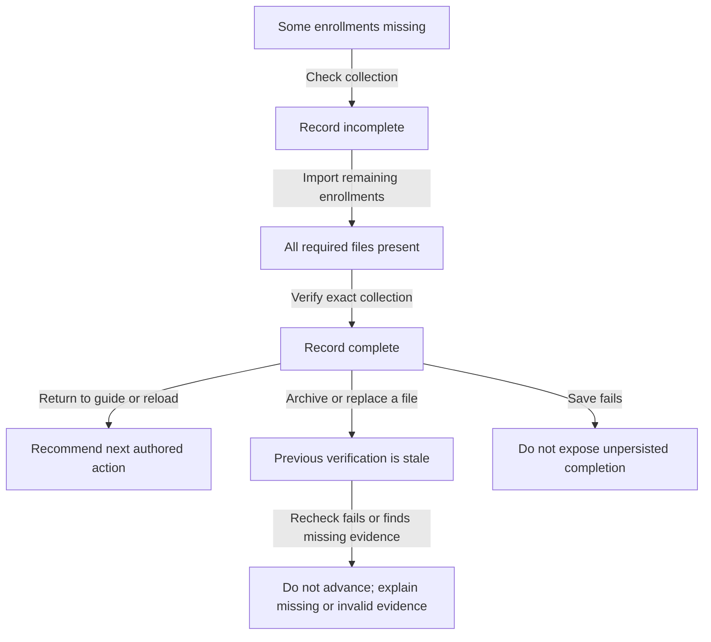

# Planned model extension: current evidence and historical checks

Status: design, not implemented in `Onboarding.tla`. The existing pilot does
not model coordinator collection history or the full CLI. Its passing results
therefore do not establish coverage of the enrollment-history bug.

## State worth distinguishing

Include a distinction when it changes the next instruction, allowed action,
or meaning of completion. Track these separately:

| State | Symbolic representation |
|---|---|
| Current collection | Required role assignments, observer minimums, artifact identities |
| Verification | Complete, incomplete, or verification failed; bound to checked inputs |
| History | Ordered check records; order is append order, not wall-clock timestamps |
| Local progress | Selected area, next action, saved completion observation |
| Uncertain operations | Separate signing/upload/contribution IDs and outcomes |

Artifact identities stand for exact bytes, including signatures and disclosures.
The verification context includes the authenticated ceremony and requirements.
Existence, a sender's report, and an older successful check are not current
verification. A file replacement invalidates the corresponding verification.

## Branching scenario

Represent this as a finite state graph, not an ever-growing tree: branches with
equivalent relevant state can merge. Bound identities and history for checking,
but retain at least two distinct check IDs so the old-incomplete/new-complete
case cannot disappear. Document bounds; passing a finite model is not a proof
for arbitrary histories or real cryptography.

## Properties and tests to add

- A newer complete collection check supersedes older incomplete observations
  for the same coordinator collection; historical records need not be deleted.
- Returning or reopening must not resurrect superseded incomplete checks.
- Later incomplete or failed verification must invalidate earlier completion.
- Advancing requires a fresh successful collection check under the authenticated
  requirements. A saved success is only a last-check result.
- Failed persistence must not allow advancement using an in-memory success.
- An unrelated successful operation must never suppress an uncertain signing,
  upload, grant, or contribution operation.
- Missing witness/mirror counts, duplicate keys/indices, changed disclosures,
  malformed files, and requirements above the minimum must remain blocking.

Use the old history-priority rule as a deliberate broken model variant. Require
the named counterexample, plus a successful-path witness in the corrected model.
This tests sensitivity and reachability, not guaranteed eventual completion.

## Connect the model to the implementation

Replay incomplete → complete → reload through the actual collection workflow,
then assert the exact recommended action (not merely its presence in a menu).
Also replay complete → archive, partial import failure, tampering before advance,
cancel after recheck, and failed save. Match observable files, verification
outcomes, saved history, and instructions after every action.

Small Go regression tests cover history selection, reload, invalidation, save
failure, and the narrow exception's boundary. These are not exhaustive trace
replay or cryptographic verification. Test real signed fixtures separately;
never mark a mocked verifier as authentication evidence.

`TestDockerEnrollmentHistoryRecovery` additionally exercises real signed public
fixtures in disposable folders: empty collection → complete collection → return
from submenu → reload → archive → incomplete → advancement refused. It passed
in Linux/ARM64 Docker on 2026-09-14 (20.43 seconds); the Go test harness ran on
macOS. Original ceremony files and keys were not changed. This is a targeted
workflow regression, not generated model-trace replay or a whole ceremony.

The implementation retains point-in-time checks and rechecks before advancing;
it does not continuously detect external changes or implement the proposed
model's exact-byte freshness tracking. Keep those limits explicit in reports.

Independent adversarial review added post-import/archive checks, failed-advance
invalidation, save-failure handling, and the distinction between last success
and current verification. No new model-checking results are claimed here.

## Guidance branches to include next

- The setup screen requests storage; opening Import must default to storage,
  not to importing the already-present ceremony set. Check submenu defaults as
  well as top-level recommendations. Present is still distinct from verified.
- Each handoff identifies sender/recipient, exact known public files, receiver
  staging instructions and the expected reply. External locations not known
  locally must be described as requested inputs, not invented verified paths.
- Resolve custody artifacts for the exact phase and turn. A newer failed
  producer cannot be replaced by an older successful one. Missing artifacts
  allow waiting/problem reporting but cannot permit reporting delivery.
- Bind the displayed snapshot to the completion report; replacing a packet or
  payload between display and confirmation must fail. Reports never imply
  verified receipt, acceptance or a completed role duty.

These are planned model properties. Local Go tests exercise contextual import
defaults, authored handoff coverage, scoped custody paths, missing/changed
payloads and waiting/problem branches; they are not exhaustive model checking.
